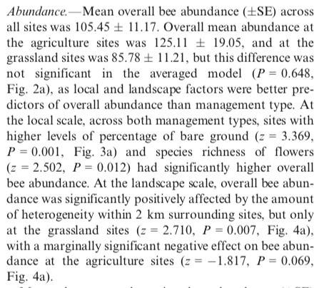
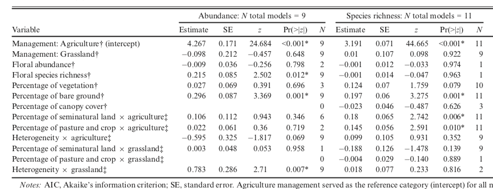
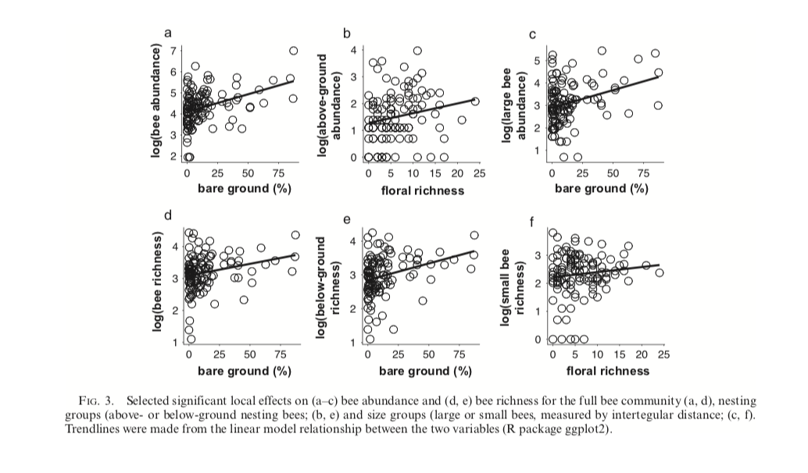

#Data Replication Assignment

```{r setup, include=FALSE}
knitr::opts_chunk$set(
	echo = TRUE,
	warning = TRUE,
	message = TRUE,
	comment = "##",
	prompt = FALSE,
	tidy = TRUE,
	tidy.opts = list(blank = FALSE, width.cutoff = 75),
	fig.path = "img/",
	fig.align = "center"
)
```

## Introduction
```
The paper, Multi-scalar drivers of biodiversity: local management mediates wild bee community response to regional urbanization, by Ballare et al., that I am reanalysing data from collected bees from 40 sites. 20 of the sites are managed as agricultural sites, and 20 of them are maintained as grasslands. The study primarily wanted to see if there was an interaction between local and landscape level complexity by using data collected in a 50x50m plot (local) such as % bare ground and % vegetation, and data collected at a 2km range (landscape) such as Heterogeniety and % semi-nautral land cover. They found that bee abundance and community diversity in locally simple habitats, such as in agricultural sites, saw a positive response to landscape level habitat complexity. The data that I imported from this paper, included all of the bees that they collected (over 12,000) labeled by site and sample period collected, the site data which included the percent cover of bare ground, vegeation, semi-natural habitat, and amount of heterogenous patches around the site, etc., and the plant data, including counts of every species found at each site. 

In the reanalysis I will be calculating the mean abundance at each site, as well as at only the agricultural or grassland sites. I then recreate two of the final linear mixed models from the paper that convey the primary drivers for species abundance and chao richness at the sites. Lastly, I recreate figure 3 from the paper using ggplot to plot various pollinator abundances and richnesses in relation to either % bare ground or plant richness.
```

```{r}
#Loading in the datasets
library(dplyr)
library(readr)
library(ggplot2)
Bees<- read_csv("Bee Table Dryad_010119.csv")
Plants<- read_csv("Floral Data Dryad.csv")
Sites<- read_csv("Site and Landscape Dryad.csv")
Sites_full<- read_csv("Site and Landscape Dryad_full.csv")
```

## Visualization of Data

```
In the paper that I chose, they included some descriptive statistics such as the overall mean bee abundance found at each site, as well as the mean abundance found at the two management types, argicultural and grassland. These descriptive statistics are calculated and displayed in the chunk below. 
```

```{r}
#exploratory data analysis 
head(Bees)
head(Plants)
head(Sites)
#creating a category to define the species combining the genus and species name 
Bees$full_species_name<- paste(Bees$insect_genus, Bees$insect_species, sep = "_")
Bees<- Bees%>% filter(nest_location != "NA") #takes out ant NAs

#averaging the %vegetation/bare ground/litter at each site across the three time points
#Sites2<- Sites %>% group_by(Site) %>% summarise(percent_veg = mean(`% Vegetation`), percent_litter = mean(`% Litter`), percent_bare = mean(`% Bare`), percent_rocky = mean(`% Rocky/Other`), percent_canopy = mean(`% Canopy Cover`))

#filtering out the rows of sites with NAs
#Sites3<- filter(Sites, `Heteogeniety (# Patches)`>0)
#combining the two data frames
#Sites4<- merge(Sites3, Sites2, by = "Site")
#ended up not having to use the code that I commented out above
Bees$count<- 1
#dividing the sites up by the sampling time
Bees$sample_period<- substr(Bees$sample_start_date, 1,1)
Bees$Site_with_date<- paste(Bees$Site, Bees$sample_period, sep = "_")
#dividing the sites up by sampling time again for the sites data frame
Sites_full$sample_period<- substr(Sites$`Veg Sample Date`, 1,1)
Sites_full$Site_with_date<- paste(Sites_full$Site, Sites_full$sample_period, sep = "_")
#doing the same thing for the plant data
Plants$sample_period<- substr(Plants$`Floral Sample Date`, 1,1)
Plants$Site_with_date<- paste(Plants$Site, Plants$sample_period, sep = "_")
Plants$site_abundance<- rowSums(Plants[,3:231])

#putting the management type in the bee dataframe so that I could filter by type
Site_management<- select(Sites, Site, Management)
Bees<- merge(Bees, Site_management, by = "Site") #I don't know why when I merged these two data frames it tripled the amount of data... it was working normally before I knitted and then something went wrong


#Calculating mean abundances at each site 
abundance<- Bees%>%group_by(Site_with_date)%>%summarise(sum(count))
mean_abundance<- mean(abundance$`sum(count)`)/3
se<- sd(abundance$`sum(count)`)/sqrt(120)/3

paste("The mean overall abundance (+/-SE) across all sites was", mean_abundance,  "+/-", se)

#Calculating abundance at the agricultural sites
abundance_ag<- Bees%>%filter(Management == "Cultivated")%>%group_by(Site_with_date)%>%summarise(sum(count))
mean_ag_abundance<- mean(abundance_ag$`sum(count)`)/3
se_ag<- sd(abundance_ag$`sum(count)`)/sqrt(60)/3

paste("The mean abundance (+/-SE) at agricultural sites was", mean_ag_abundance,  "+/-", se_ag)

#Calculating abundance at the grassland sites
abundance_grass<- Bees%>%filter(Management == "Grassland")%>%group_by(Site_with_date)%>%summarise(sum(count))
mean_grass_abundance<- mean(abundance_grass$`sum(count)`)/3
se_grass<- sd(abundance_grass$`sum(count)`)/sqrt(60)/3 #These means were working before I knitted, but then it got tripled somehow so I had to divide by 3 to get the results I had before

paste("The mean abundance (+/-SE) at grassland sites was", mean_grass_abundance,  "+/-", se_grass)

#From the paper:

```

## Replications/Reanalysis

```{r}
library(vegan)
library(reshape2)
#Inferential statistic - recreating the linear mixed model
site_species_matrix<- read_csv("Species_tbl.csv") #had to create a pivot table in excel to get the data in the right format to calculate the chao richness
#calculating the chao species richness for pollinators and plants 
chao<- estimateR(site_species_matrix[,-1]) #takes out the first column because you can't run the site in this function
chao<- as.data.frame(t(chao)) #transposes the list and makes in a data frame
chao%>% summarise(mean= mean(S.chao1)) #gets the mean richness
chao<- cbind(chao, Sites_full$Site_with_date) #puts the site name in the dataframe
colnames(chao)<- c("S.obs.poll", "S.chao1.poll", "se.chao1.poll", "s.ACE.poll", "se.ACE.poll",  "Site_with_date")

chao_plants<- estimateR(Plants[,3:231]) #calculates chao diversity
chao_plants<- as.data.frame(t(chao_plants)) #transposes the dataframe
chao_plants<- cbind(chao_plants, Plants$Site_with_date) #puts the site name in the dataframe
colnames(chao_plants)<- c("S.obs.plant", "S.chao1.plant", "se.chao1.plant", "s.ACE.plant", "se.ACE.plant",  "Site_with_date") #changes the name of the column 

#putting everything in one data frame so that I can run the model 
full_dataset<- cbind(chao, chao_plants, Plants, Sites_full, abundance)

library(lme4)
#creating the model for abundance
abundance_model<- lmer(log(`sum(count)`+1) ~ Management + scale(site_abundance) + scale(S.chao1.plant) + scale(`% Vegetation`) + scale(`% Bare`) + scale(`% Canopy Cover`) + scale(`% Semi-Natural`)*Management + scale(`% Crop`) * Management + scale(`Heteogeniety (# Patches)`) * Management + (1|`Floral Sample Date`), full_dataset, na.action = na.fail)
summary(abundance_model)
coefs.abundance <- data.frame(coef(summary(abundance_model))) #lmer does not give p-values in the summary so these next few lines of code extract those from the model
coefs.abundance$p.z <- 2 * (1 - pnorm(abs(coefs.abundance$t.value)))
coefs.abundance

#creating the model for chao richness
chao_model<- lmer(log(S.chao1.poll +1) ~ Management + scale(site_abundance) + scale(S.chao1.plant) + scale(`% Vegetation`) + scale(`% Bare`) + scale(`% Canopy Cover`) + scale(`% Semi-Natural`)*Management + scale(`% Crop`) * Management + scale(`Heteogeniety (# Patches)`) * Management + (1|`Floral Sample Date`), full_dataset, na.action = na.fail)

summary(chao_model)
coefs.chao <- data.frame(coef(summary(chao_model)))
coefs.chao$p.z <- 2 * (1 - pnorm(abs(coefs.chao$t.value)))
coefs.chao



#The summary and p-values are pretty close to their final model. I was not able to include nest site within city, as the paper did because they did not include that in their dataset that I pulled from online.

#to make figure 3 I need to separate the above and below ground nesting bees and the small and large bees
#grouping the bees 
log_abundance<- Bees%>%group_by(Site_with_date)%>%summarise(log(sum(count)))
log_abundance_bare<- merge(log_abundance, Sites_full, by = "Site_with_date")

#plots the log abundance vs bare ground cover
abundance_bare <- ggplot(data = log_abundance_bare, aes(x = `% Bare`, y = `log(sum(count))`)) + geom_point(na.rm = TRUE, shape =1, size = 3) + geom_smooth(method = "lm", se = FALSE, na.rm = TRUE, color = "black") + labs(x="bare ground (%)", y ="log(bee abundance)") + theme(plot.title = element_text(hjust = 0.5, size = 12), panel.grid.major = element_blank(), panel.grid.minor = element_blank(),
panel.background = element_blank(), axis.line = element_line(colour = "black"))
abundance_bare

#gets richness with bare ground
chao$log_richness<- log(chao$S.chao1.poll)
log_richness_bare<- merge(chao, Sites_full, by = "Site_with_date")

richness_bare <- ggplot(data = log_richness_bare, aes(x = `% Bare`, y = log_richness)) + geom_point(na.rm = TRUE, shape =1, size = 3) + geom_smooth(method = "lm", se = FALSE, na.rm = TRUE, color = "black") + labs(x="bare ground (%)", y ="log(bee richness)") + theme(plot.title = element_text(hjust = 0.5, size = 12), panel.grid.major = element_blank(), panel.grid.minor = element_blank(),
panel.background = element_blank(), axis.line = element_line(colour = "black"))
richness_bare

#log of only above-ground bee abundance vs floral richness
log_abundance_above<- Bees%>%filter(nest_location == "above")%>%group_by(Site_with_date)%>%summarise(log(sum(count)))
log_abundance_above_floralrichness<- merge(log_abundance_above, chao_plants, by = "Site_with_date")

above_abundance <- ggplot(data = log_abundance_above_floralrichness, aes(x = S.chao1.plant, y = `log(sum(count))`)) + geom_point(na.rm = TRUE, shape =1, size = 3) + geom_smooth(method = "lm", se = FALSE, na.rm = TRUE, color = "black") + labs(x="floral richness", y ="log(above-ground \n abundance)") + theme(plot.title = element_text(hjust = 0.5, size = 12), panel.grid.major = element_blank(), panel.grid.minor = element_blank(),
panel.background = element_blank(), axis.line = element_line(colour = "black"))
above_abundance

#log of only large bee abundance vs Bare ground
log_abundance_large<- Bees%>%filter(size == "large")%>%group_by(Site_with_date)%>%summarise(log(sum(count)))
log_abundance_large_bare<- merge(log_abundance_large, Sites_full, by = "Site_with_date")

large_abundance <- ggplot(data = log_abundance_large_bare, aes(x = `% Bare`, y = `log(sum(count))`)) + geom_point(na.rm = TRUE, shape =1, size = 3) + geom_smooth(method = "lm", se = FALSE, na.rm = TRUE, color = "black") + labs(x="bare ground (%)", y ="log(large bee \n abundance)") + theme(plot.title = element_text(hjust = 0.5, size = 12), panel.grid.major = element_blank(), panel.grid.minor = element_blank(),
panel.background = element_blank(), axis.line = element_line(colour = "black"))
large_abundance

#log of only below groumd bees richness vs bare ground
below_bees<- read_csv("below_bees.csv") #had to make seperate pivot tables in excel for the below ground nesting bees because I couldn't figure out a way to do that in R
chao.below.bees<- estimateR(below_bees[,-1])
chao.below.bees<- as.data.frame(t(chao.below.bees))
chao.below.bees<- cbind(chao.below.bees, below_bees$Site_with_date) #puts the site name in the dataframe
colnames(chao.below.bees)[6]<- "Site_with_date"
chao.below.bees$log_richness<- log(chao.below.bees$S.chao1)
log_richness_below<- merge(chao.below.bees, Sites_full, by = "Site_with_date")

below_richness <- ggplot(data = log_richness_below, aes(x = `% Bare`, y = log_richness)) + geom_point(na.rm = TRUE, shape =1, size = 3) + geom_smooth(method = "lm", se = FALSE, na.rm = TRUE, color = "black") + labs(x="bare ground (%)", y ="log(below-ground \n richness)") + theme(plot.title = element_text(hjust = 0.5, size = 12), panel.grid.major = element_blank(), panel.grid.minor = element_blank(),
panel.background = element_blank(), axis.line = element_line(colour = "black"))
below_richness

#log of only below groumd bees richness vs bare ground
small_bees<- read_csv("small_bees.csv")
chao.small.bees<- estimateR(small_bees[,-1])
chao.small.bees<- as.data.frame(t(chao.small.bees))
chao.small.bees<- cbind(chao.small.bees, small_bees$Site_with_date) #puts the site name in the dataframe
colnames(chao.small.bees)[6]<- "Site_with_date"
chao.small.bees$log_richness<- log(chao.small.bees$S.chao1)
log_richness_small<- merge(chao.small.bees, chao_plants, by = "Site_with_date")

small_richness <- ggplot(data = log_richness_small, aes(x = S.chao1.plant, y = log_richness)) + geom_point(na.rm = TRUE, shape =1, size = 3) + geom_smooth(method = "lm", se = FALSE, na.rm = TRUE, color = "black") + labs(x="floral richness", y ="log(small bee \n richness)") + theme(plot.title = element_text(hjust = 0.5, size = 12), panel.grid.major = element_blank(), panel.grid.minor = element_blank(),
panel.background = element_blank(), axis.line = element_line(colour = "black"))
small_richness

library(patchwork)
(abundance_bare|above_abundance|large_abundance)/(richness_bare|below_richness|small_richness)

#from the actual paper:

```

## Summary/Discussion

```
I think the descriptive statistics at the beginning, although off by a couple of decimal points, were fairly accurately replicated. One problem I encountered when replicating this was that the data set that I downloaded offline did not have the nesting location (below or above) or size (large or small) in it, but I did find those listings in the supplemental information, but not in an excel sheet, so I had to copy it over to the main bees data sheet. While this was not hard to do, there were a couple of species missing in the supplemental information, so I had to write them in as NAs, which the authors might not have had to do, so that might be why the numbers in the mean abundances were slightly off. 

When creating the linear models, the authors state that they used site nested within city as a random effect, but again the city was not included in the sites dataset as a variable, so I was not able to include this in the model. With that being said, I think that the esitmates from the model in the summary output are pretty close to the actual paper. 

Lastly, with the visualization of firgure 3, I think I was able to recreate this pretty accurately. I did have to go into excel to create pivot tables to rerun the chao estimator on the populations this way. Whehn doing this, if the sites did not have any small or below ground nesting bees, for example, then some of the points were missing from the plot that I think they may have included as zeros. 
```

## References
```{r}
knitr::include_graphics("Ballare_et_al-2019-Ecological_Applications.pdf")
```
```
Ballare, K. M., Neff, J. L., Ruppel, R., & Jha, S. (2019). Multi‐scalar drivers of biodiversity: local management mediates wild bee community response to regional urbanization. Ecological applications, 29(3), e01869.
```

